# MicroInspect — Bare-Board PCB Defect Detection

---

## Team

- **E/23/336**, S.M.D.S.B. Samarakoon, [email](mailto:e23336@eng.pdn.ac.lk)
- **E/23/104**, G.P.M. Gamage, [email](mailto:e23104@eng.pdn.ac.lk)
- **E/23/035**, P.I.N. Bandara, [email](mailto:e23035@eng.pdn.ac.lk)
- **E/23/117**, W.R.A.D.N. Gunathilake, [email](mailto:e23117@eng.pdn.ac.lk)

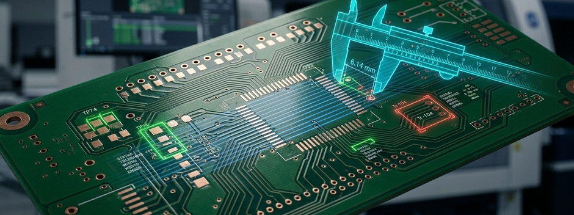

---

## Table of Contents

1. [Introduction](#introduction)
2. [Problem Statement](#problem-statement)
3. [Objectives](#objectives)
4. [Dataset and Defect Classes](#dataset-and-defect-classes)
5. [Solution Architecture](#solution-architecture)
6. [Classical Computer Vision Approach](#classical-computer-vision-approach)
7. [Deep Learning Approach](#deep-learning-approach)
8. [Experimental Results](#experimental-results)
9. [Classical vs Deep Learning](#classical-vs-deep-learning)
10. [Demonstration Interface](#demonstration-interface)
11. [Limitations and Failure Analysis](#limitations-and-failure-analysis)
12. [Conclusion and Future Work](#conclusion-and-future-work)
13. [Links](#links)

---

## Introduction

Printed Circuit Boards (PCBs) are manufactured through highly precise processes in which small fabrication defects can affect electrical connectivity and the reliability of the final product. Detecting these defects early is therefore an important part of PCB quality assurance.

**MicroInspect** is a computer vision based inspection system designed to automatically detect and classify defects in bare-board PCBs. The system investigates two complementary approaches to automated visual inspection:

- **Classical computer vision**, using a reference PCB, image alignment, image differencing and structural/topological reasoning.
- **Deep learning**, using a YOLOv11-Medium object detector combined with high-resolution image tiling.

The system focuses on six common PCB defect categories:

- Missing Hole
- Mouse Bite
- Open Circuit
- Short
- Spur
- Spurious Copper

Rather than relying on a single technique, MicroInspect explores how traditional image-processing methods and modern deep-learning approaches behave on the same inspection problem.

The project therefore provides not only a practical PCB defect detection system, but also a comparative study of **rule-based structural reasoning versus learned visual representations**.

---

## Problem Statement

Manual PCB inspection can be time-consuming and difficult when defects are small, visually similar, or distributed across a high-resolution board.

A major challenge is that several PCB defects have similar visual appearances while representing fundamentally different manufacturing problems. For example, an additional copper region may represent a spur, a short, or spurious copper depending on how it relates to the surrounding copper traces.

A robust automated inspection system therefore needs to answer two questions:

1. **Where is the defect?**
2. **What type of manufacturing defect is it?**

MicroInspect addresses these questions using both image-processing rules derived from PCB structure and a learned object-detection model.

---

## Objectives

The main objectives of MicroInspect are:

- Develop an automated system for detecting PCB manufacturing defects.
- Detect and classify six bare-board PCB defect categories.
- Develop a reference/template-based classical computer vision pipeline.
- Introduce topological reasoning to improve classical defect classification.
- Develop a YOLOv11-Medium deep-learning detector.
- Preserve small defect details using high-resolution image tiling.
- Compare classical and deep-learning approaches.
- Provide a practical interface for running PCB inspection methods.
- Investigate the strengths and limitations of each approach.

---

## Dataset and Defect Classes

MicroInspect works with PCB image datasets containing annotated defect regions.

The system processes high-resolution PCB images and corresponding defect annotations. For the deep-learning pipeline, images are converted into overlapping **640 × 640 pixel tiles** so that small defects are not lost when high-resolution boards are resized directly to the model input resolution.

A **15% tile overlap** is used to reduce the probability of defects being split across tile boundaries.

### Defect Categories

| Defect | Description |
|---|---|
| **Missing Hole** | A required drilled hole is absent from the PCB. |
| **Mouse Bite** | An irregular or damaged edge region caused by incomplete material removal. |
| **Open Circuit** | A conductive trace is unintentionally broken. |
| **Short** | Unwanted copper creates an electrical connection between conductive regions. |
| **Spur** | An unwanted copper protrusion extends from a legitimate conductive trace. |
| **Spurious Copper** | An isolated region of unwanted copper exists where no conductive feature should be present. |

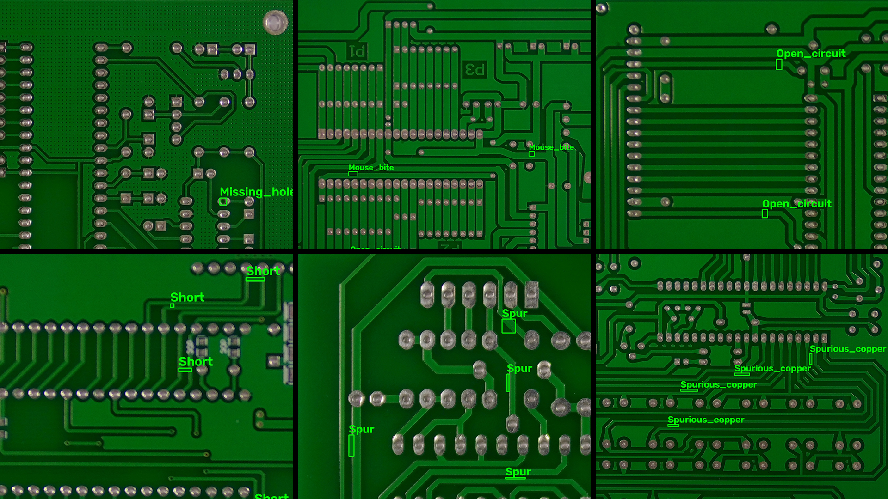

---

# Solution Architecture

MicroInspect consists of three main inspection modes exposed through a common demonstration interface:

1. **Classical**
2. **Classical Topological**
3. **Deep Learning**

The classical topological pipeline is the primary classical approach used for comparison because it incorporates structural information about PCB connectivity rather than relying only on pixel-level differences.

### Overall Processing Flow

```text
                    PCB Test Image
                          │
             ┌────────────┴────────────┐
             │                         │
             ▼                         ▼
     Classical Pipeline          Deep Learning Pipeline
             │                         │
     Reference Template          High-Resolution Tiling
             │                         │
       ORB + RANSAC               640 × 640 Tiles
             │                         │
       Image Alignment            YOLOv11-Medium
             │                         │
      Difference Detection        Global Coordinate Mapping
             │                         │
     Morphological Processing      Class-Aware NMS
             │                         │
      Topological Reasoning            │
             │                         │
             └────────────┬────────────┘
                          │
                          ▼
                 Defect Detections
                          │
                          ▼
                 Demonstration UI
```

---

# Classical Computer Vision Approach

The classical approach uses a **reference/template PCB** and compares it with the test PCB.

The core idea is that a defect produces a structural difference between an expected board and the observed board.

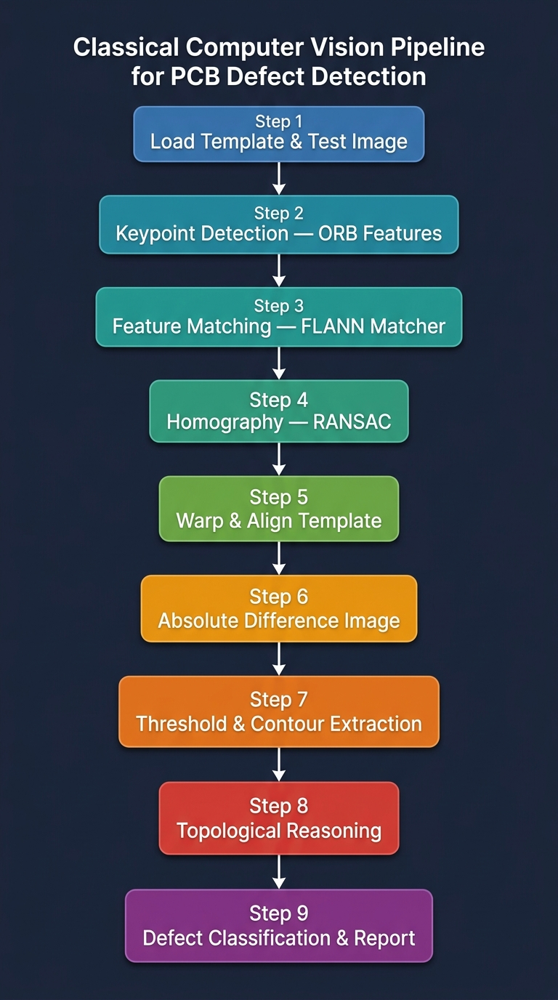

## 1. Image Alignment

Before comparing the images, the test image must be aligned with the reference PCB.

MicroInspect uses:

* ORB feature detection
* Hamming-distance feature matching
* Homography estimation
* RANSAC
* Rotation attempts at 0°, 90°, 180° and 270°

This compensates for changes in board orientation and small differences in image positioning.

---

## 2. Difference Detection

After alignment, the system calculates the absolute pixel difference between the reference and test images.

The resulting difference image is processed using:

* CLAHE-based grayscale preprocessing
* Otsu thresholding
* Morphological opening
* Morphological closing
* Connected contour extraction

This produces candidate defect regions.

---

## 3. Topological Reasoning

Pixel differences alone are insufficient to reliably distinguish all six defect categories.

MicroInspect therefore introduces **topological reasoning** based on how the detected region interacts with PCB copper structures.

<!--  -->

The classification logic can be summarized as follows:

### Missing Hole

The system examines contour hierarchy and determines whether a detected region corresponds to an expected internal hole within a copper region.

### Added Copper

For an additional copper region, the system examines its relationship with the original copper traces:

```text
Added Copper
     │
     ├── No connected template traces
     │        └── Spurious Copper
     │
     ├── Connected to one trace
     │        └── Spur
     │
     └── Connected to two or more traces
              └── Short
```

### Removed Copper

For a removed copper region:

```text
Removed Copper
      │
      ├── One remaining connected region
      │        └── Mouse Bite
      │
      └── Two or more connected regions
               └── Open Circuit
```

This allows the classical method to distinguish defects based on **structural relationships**, rather than solely on appearance.

---

# Deep Learning Approach

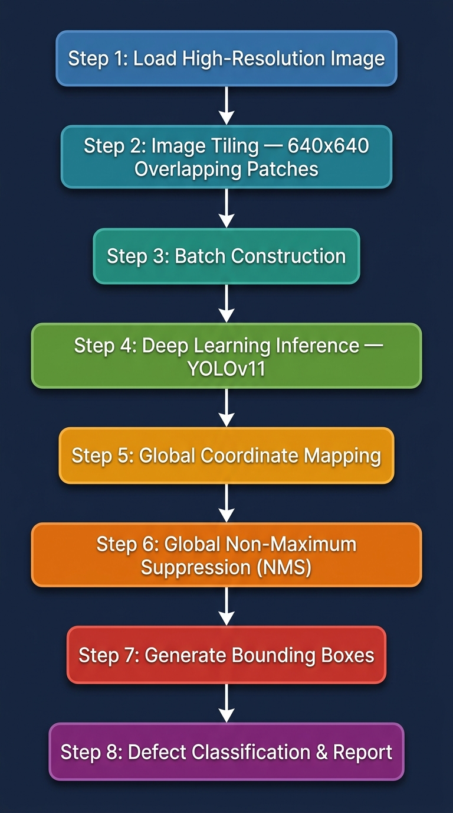

The deep-learning pipeline uses **YOLOv11-Medium** for object detection.

The final Medium training configuration uses:

* YOLOv11-Medium
* 640 × 640 input resolution
* Batch size: 8
* 100 training epochs
* Pretrained weights
* Automatic optimizer selection
* Mosaic augmentation
* MixUp augmentation
* Geometric and colour augmentation

---

## High-Resolution Tiling

A major challenge in PCB inspection is that defects can be extremely small compared with the complete board image.

Directly resizing an entire high-resolution PCB to 640 × 640 can therefore remove important defect details.

MicroInspect addresses this through overlapping image tiles.

```text
High-Resolution PCB
        │
        ▼
 ┌──────┬──────┬──────┐
 │Tile 1│Tile 2│Tile 3│
 ├──────┼──────┼──────┤
 │Tile 4│Tile 5│Tile 6│
 └──────┴──────┴──────┘
        │
        ▼
 YOLOv11-Medium
        │
        ▼
 Local Bounding Boxes
        │
        ▼
 Global Coordinate Mapping
        │
        ▼
 Class-Aware NMS
        │
        ▼
 Final PCB Detections
```

The preprocessing pipeline uses 640 × 640 tiles with 15% overlap. Defect bounding boxes are converted into tile-local coordinates and retained when sufficient portions of the defect fall within the tile.

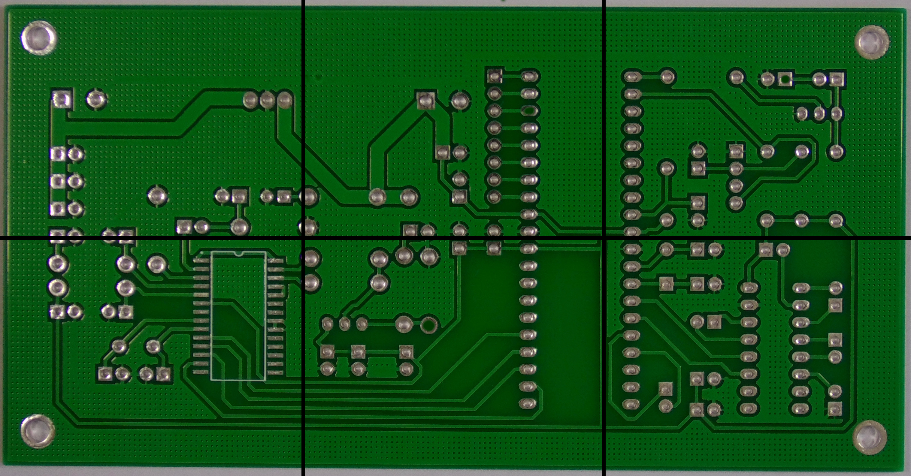

---

## Global Detection

Predictions generated independently on each tile are mapped back into the coordinate system of the original PCB image.

Because overlapping tiles may detect the same defect more than once, MicroInspect applies **class-aware global Non-Maximum Suppression (NMS)** to remove duplicate detections.

This produces a final set of detections in the original image coordinate system.

---

# Experimental Results

The final YOLOv11-Medium experiment completed all **100 training epochs**.

The final recorded validation metrics were:

| Metric    |     Result |
| --------- | ---------: |
| Precision | **97.16%** |
| Recall    | **90.97%** |
| mAP@50    | **92.01%** |
| mAP@50–95 | **67.25%** |

### Interpreting the Results

**Precision — 97.16%**

The high precision indicates that the model's detected defects are generally reliable, with relatively few false-positive detections.

**Recall — 90.97%**

The model successfully detects the majority of annotated defects, although some difficult or visually subtle defects remain undetected.

**mAP@50 — 92.01%**

At an IoU threshold of 0.50, the model achieves strong overall detection performance.

**mAP@50–95 — 67.25%**

The lower value compared with mAP@50 reflects the more demanding localization criteria used across IoU thresholds from 0.50 to 0.95.

---

## Training Results

The training run generated precision, recall, F1 and precision-recall curves, together with the complete epoch-by-epoch training history.

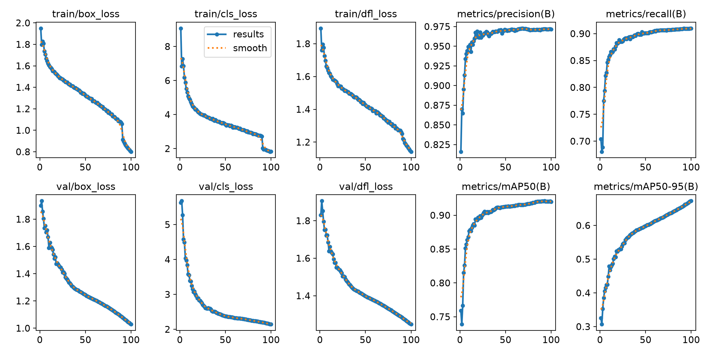

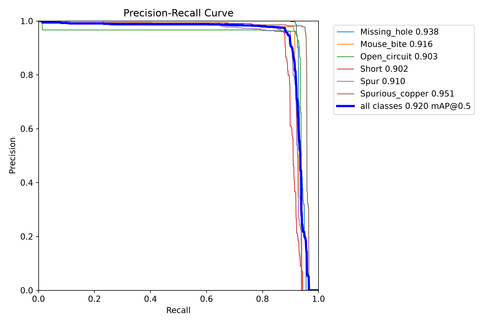

### Inference Examples

| Missing Hole | Mouse Bite | Open Circuit |
|---|---|---|
| 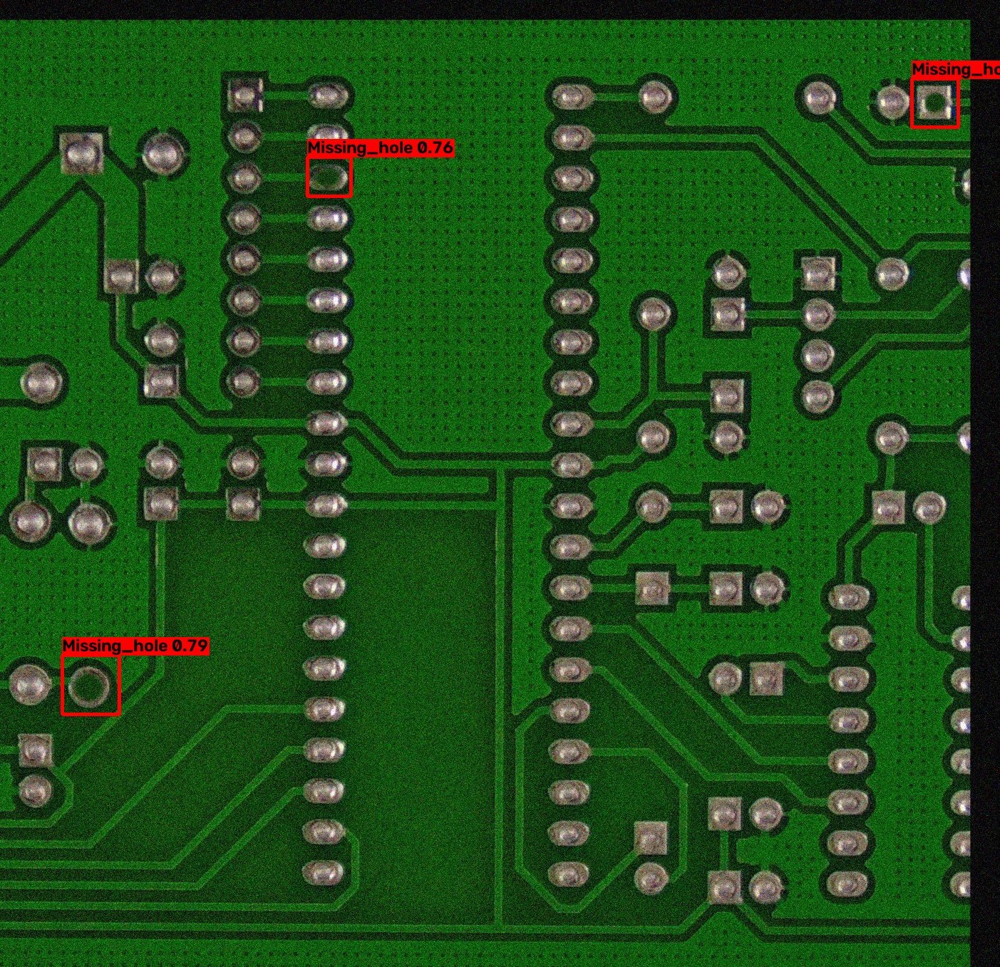 | 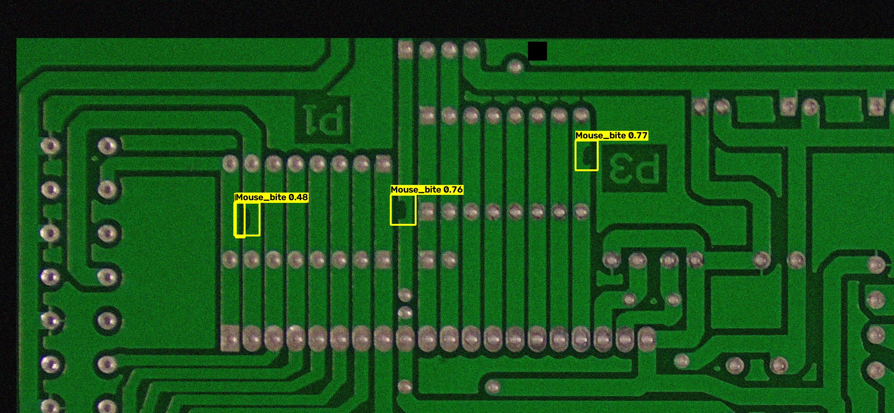 | 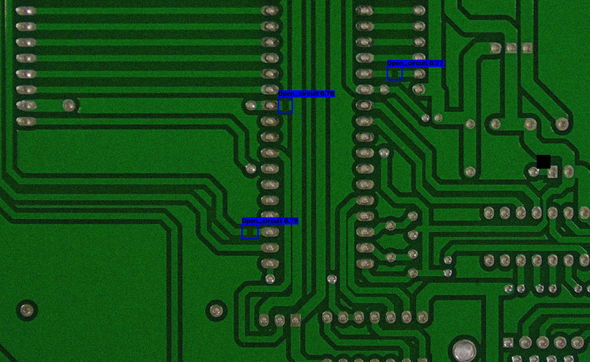 |

| Short | Spur | Spurious Copper |
|---|---|---|
| 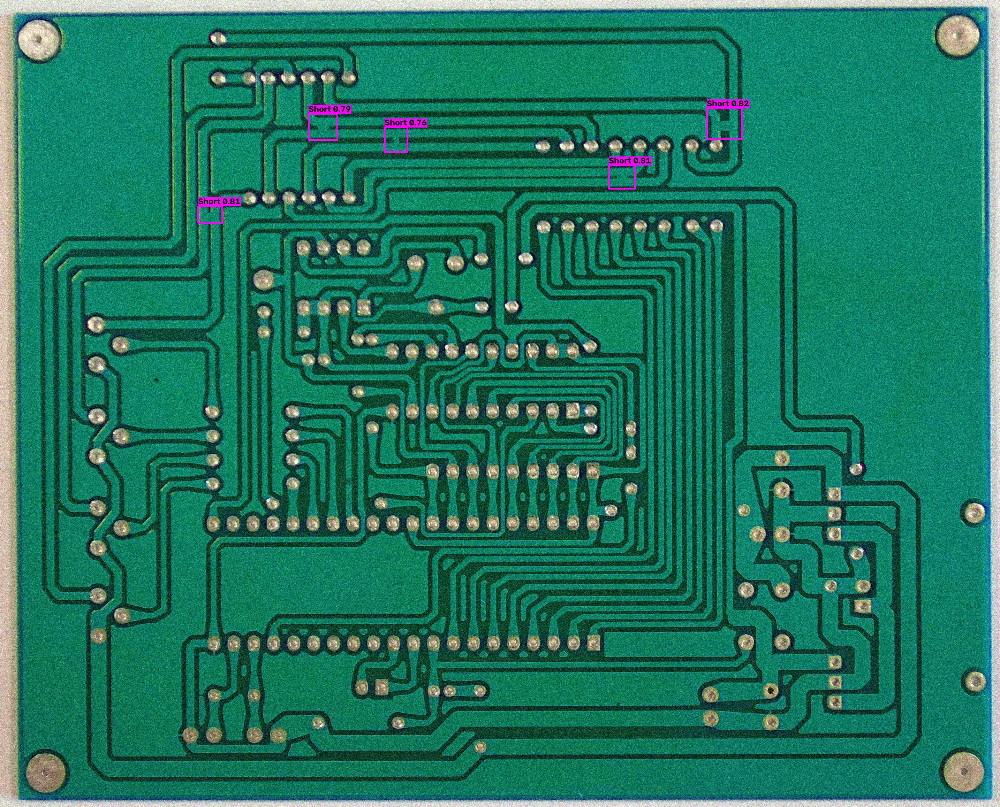 | 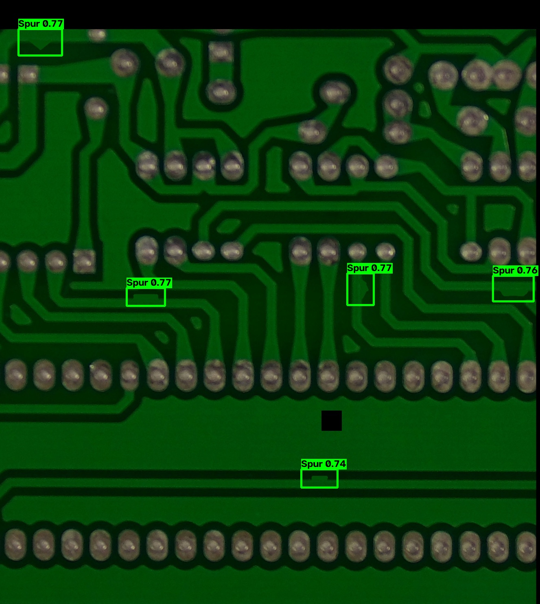 | 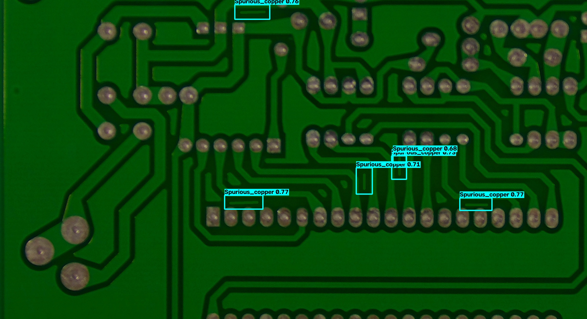 |

---

## Confusion Matrix

The YOLO training run also produced both raw and normalized confusion matrices.

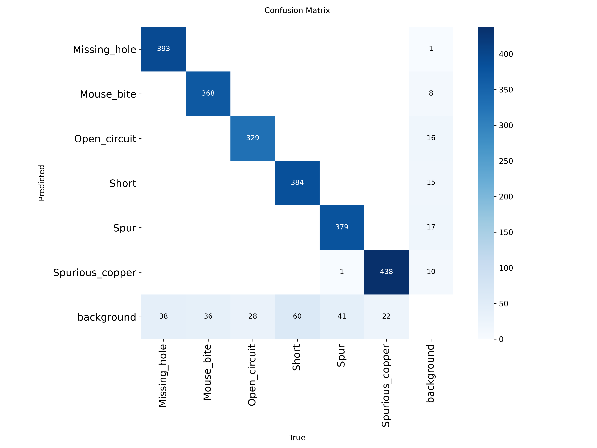

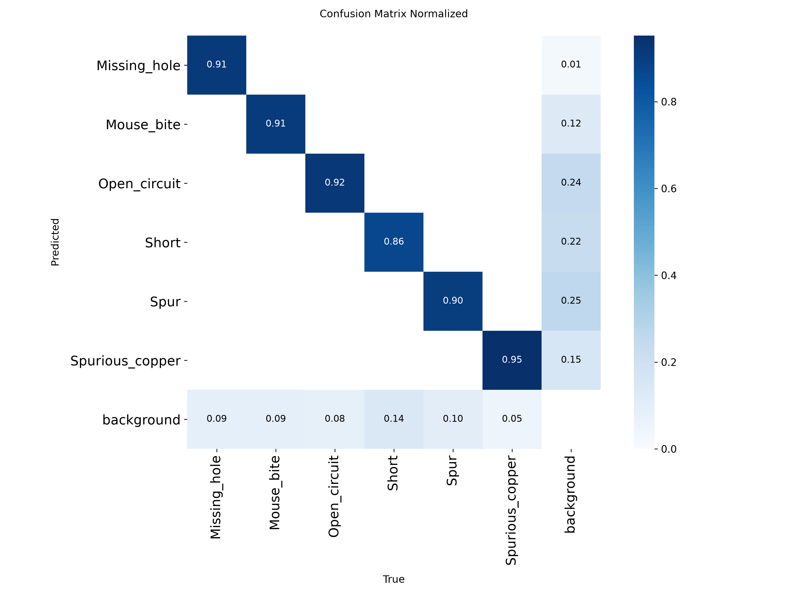

The confusion matrix provides class-level insight into which defect categories are easier to distinguish and where visual similarities lead to misclassification.

It is important to distinguish this from the classical inference process: the classical topological detector itself does not naturally output a confusion matrix. A confusion matrix for classical predictions is an **evaluation-layer construct**, obtained by matching its detections against ground-truth annotations.

---

# Classical vs Deep Learning

The two approaches solve the same inspection problem using fundamentally different sources of information.

| Aspect                      | Classical Topological                     | YOLOv11-Medium                          |
| --------------------------- | ----------------------------------------- | --------------------------------------- |
| Main principle              | Reference-based structural comparison     | Learned object detection                |
| Requires reference template | Yes                                       | No                                      |
| Feature representation      | Hand-designed image/topological features  | Learned visual features                 |
| Alignment                   | ORB + RANSAC                              | Not required for detection              |
| Small-defect handling       | Dependent on image quality and thresholds | Improved through high-resolution tiling |
| Classification              | Explicit topology rules                   | Learned class predictions               |
| Confidence scores           | No native confidence score                | Yes                                     |
| Interpretability            | High                                      | Lower                                   |
| Adaptability                | Limited by designed rules                 | Can learn varied visual patterns        |
| Computational pipeline      | Image processing + rules                  | Neural network inference                |

The comparison highlights an important engineering trade-off.

The classical method is **transparent and structurally interpretable**. Its decisions can be traced through alignment, difference masks and topology rules.

The deep-learning method is **more flexible and data-driven**, allowing it to learn visual patterns that are difficult to encode manually.

---

# Demonstration Interface

MicroInspect provides a browser-based demonstration interface built around a FastAPI backend.

The interface allows users to select an inspection method and submit a PCB image for analysis.

Supported methods include:

* `dl`
* `classical`
* `classical_topological`

The system processes the selected image and presents the generated inspection outputs.

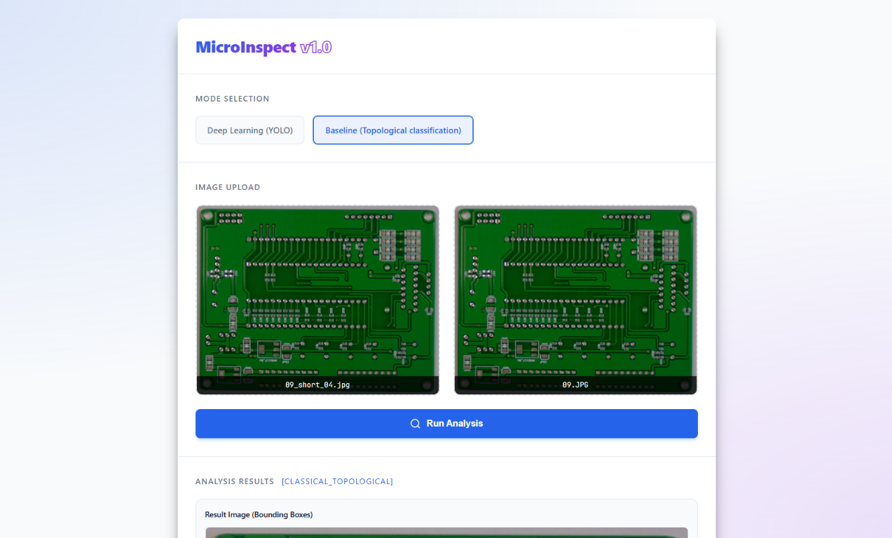

The interface provides a practical way to demonstrate and compare the inspection approaches without requiring users to directly interact with the underlying Python implementation.

---

# Limitations and Failure Analysis

Although both approaches demonstrate effective PCB defect detection, each has limitations.

## Classical Method Limitations

### Sensitivity to Alignment

The classical approach depends on accurate registration between the test PCB and reference PCB. Poor feature matching or significant image variation can reduce detection accuracy.

### Fixed Thresholds

Thresholds used for difference detection and morphology are dependent on image characteristics and board structure.

### Topological Ambiguity

Some defects can become difficult to distinguish when their geometry does not clearly match the assumptions used by the classification rules.

### No Native Confidence

The deterministic classical pipeline does not naturally provide a confidence score for each classification.

---

## Deep Learning Limitations

### Dataset Dependence

The YOLO detector depends on representative annotated training data. Performance may decrease when encountering PCB layouts, imaging conditions or defect appearances that differ substantially from the training distribution.

### Localization Difficulty

The difference between mAP@50 and mAP@50–95 demonstrates that achieving accurate bounding-box localization at stricter IoU thresholds remains more challenging.

### Computational Cost

Running a detector over multiple overlapping high-resolution tiles requires more computation than processing a single resized image.

---

# Conclusion and Future Work

MicroInspect demonstrates two distinct approaches to automated bare-board PCB inspection.

The **classical topological approach** combines reference-based image comparison with structural reasoning. Rather than treating every pixel difference equally, it examines how defect regions relate to the conductive structure of the PCB.

The **YOLOv11-Medium approach** provides a learned object-detection solution capable of identifying the six target defect categories while using high-resolution tiling to preserve small defect details.

The final Medium model achieved:

* **97.16% Precision**
* **90.97% Recall**
* **92.01% mAP@50**
* **67.25% mAP@50–95**

The project demonstrates that neither approach should be viewed simply as a replacement for the other. Instead, their complementary characteristics suggest a potential **hybrid inspection architecture**.

## Future Hybrid Approach

A future version of MicroInspect could combine both approaches:

```text
              PCB Image
                  │
                  ▼
          YOLO Candidate Detection
                  │
          ┌───────┴────────┐
          │                │
       Confident        Uncertain
       Detection         Region
          │                │
          │                ▼
          │        Topological Verification
          │                │
          └───────┬────────┘
                  ▼
            Final Decision
```

YOLO could provide fast candidate detection across the board, while classical topological reasoning could act as a verification mechanism for ambiguous cases.

This hybrid strategy combines the **adaptability of learned detection** with the **interpretability and structural reasoning of classical computer vision**.

---

# Links

* [Project Repository](https://github.com/cepdnaclk/e23-co5430-PCB-Bare-Board-Defect-Detection)
* [Project Page](https://cepdnaclk.github.io/e23-co5430-PCB-Bare-Board-Defect-Detection/)
* [Department of Computer Engineering](http://www.ce.pdn.ac.lk/)
* [University of Peradeniya](https://eng.pdn.ac.lk/)
